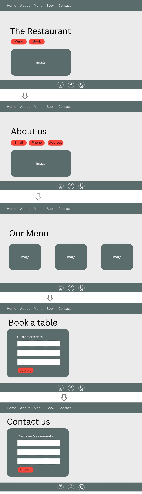

# Restaurant React.JS Project

Proyecto creado usando la librería para JavaScript "React.JS".
La página web desarrollada muestra un restaurant ficticio llamado "RetroRestaurant" el cual cuenta con secciones tales como menú, contacto, sección de reservas de mesas donde el usuario ingresa sus datos los cuales quedan almacenados en una base de datos externa.
Uso de estética "retro" acorde al efecto deseado (consultar sección "prototipado" para más detalles). Se utilizó el comando "npm-run-build" para realizar el deployment.


## **Índice**

* [1. Demo](#1-demo)
* [2. Instalación](#2-instalación)
* [3. Funciones utilizadas](#3-funciones-utilizadas)
* [4. Desarrollo](#4-desarrollo)
* [5. Prototipado](#5-prototipado)
* [6. Autores](#6-autores)

***

## 1. Demo 

[Demo](https://famous-vacherin-56ae21.netlify.app/)

## 2. Instalación 

Instalación de componentes:

```bash
  npm install 
```
Inicialización en servidor local:

```bash
  npm start
```

## 3. Funciones utilizadas

- Almacenamiento de datos en Firestore (en la consola consultar respuesta generada por console.log para recibir ID único generado por Firestore por cada ingreso de datos).
- Librería React.JS (componentes y props)
- Paquete ReactDom (useNavigate, Link, Outlet)
- React Hooks (useState, useEffect)
- Modals que cierran con el uso de un botón
- Media queries para versión móvil


## 4. Desarrollo

Instalación de firebase con npm:

```bash
  npm i firebase
```
Instalación de react con npm:

```bash
  npm i react
```
Instalación de react-dom con npm:

```bash
  npm i react-dom
```
Instalación de react-router-dom con npm:

```bash
  npm i react-router-dom
```
## 5. Prototipado



## 6. Autores

- [Darío Ávila](https://github.com/darioavila2022)
- [Paulina Cárcamo](https://github.com/PaulinaCarcamo)

